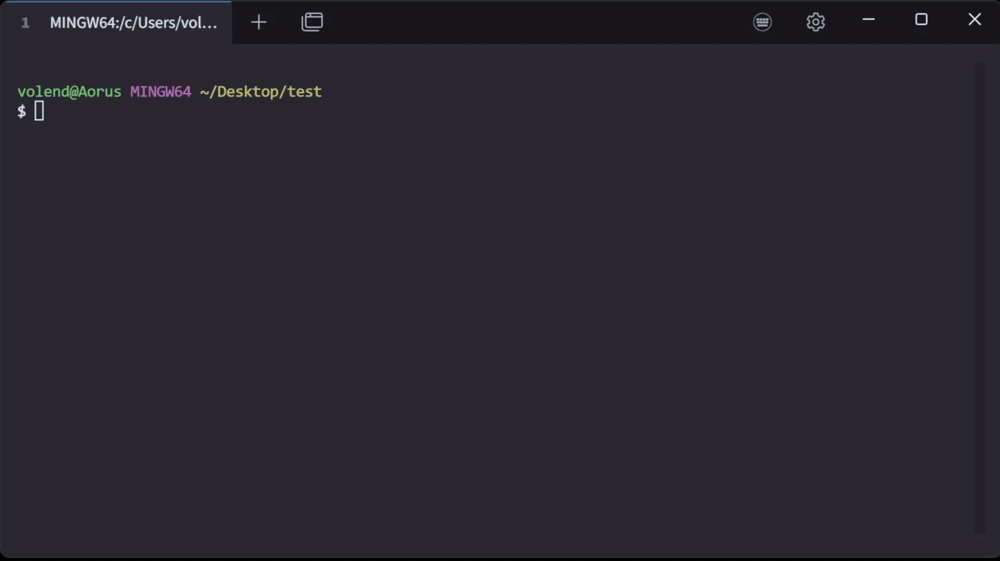

# Latenode Docs
<p align="center">
  
</p>

## What is this
This repo contains:
 * Scraped docs for Latenode and Nodul in `.md` format
 * A Bash script to clean, rename, and format the files
 * A Postman collection for running Firecrawl

## Usage
This repository provides the latest Markdown copies of Latenode and Nodul documentation, which you can:
 * **Plug into LLM tools** like NotebookLM for research or guidance.
 * **Link in Cursor IDE** to write and test JavaScript nodes for your automation scenarios.

### Keeping docs up to date
If you need to refresh the documentation yourself, use the provided Postman collection `Firecrawl Latenode Docs.postman_collection.json`, which includes ready-to-use API requests to Firecrawl with the required parameters and post-response scripts.

### Preparing files for LLMs
After crawling, use `doc_utils.sh` to:
 * Rename files to readable titles
 * Remove empty or redundant `.md` files
 * Strip emojis and unwanted characters
```Bash
chmod +x doc_utils.sh
./doc_utils.sh
```
OR
```Bash
./doc_utils.sh --all
```
<p align="center">
  
</p>

## Licence
This repository contains Markdown copies of Latenode documentation scraped from latenode.com for personal use and reference. No license granted – please refer to original documentation at https://help.latenode.com/ for official terms.